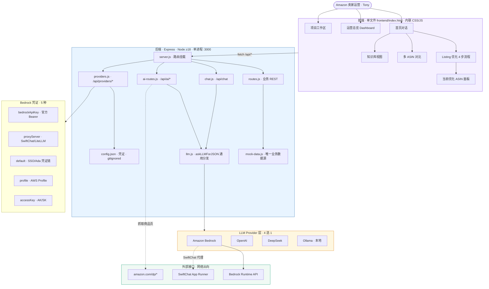
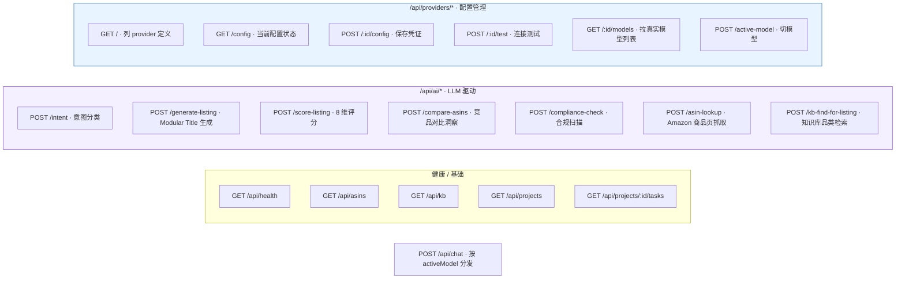
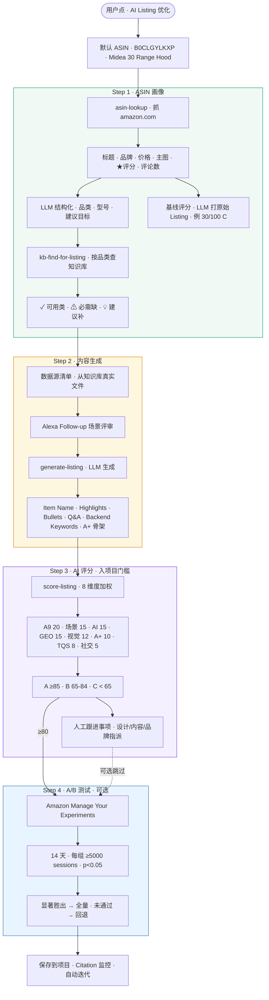
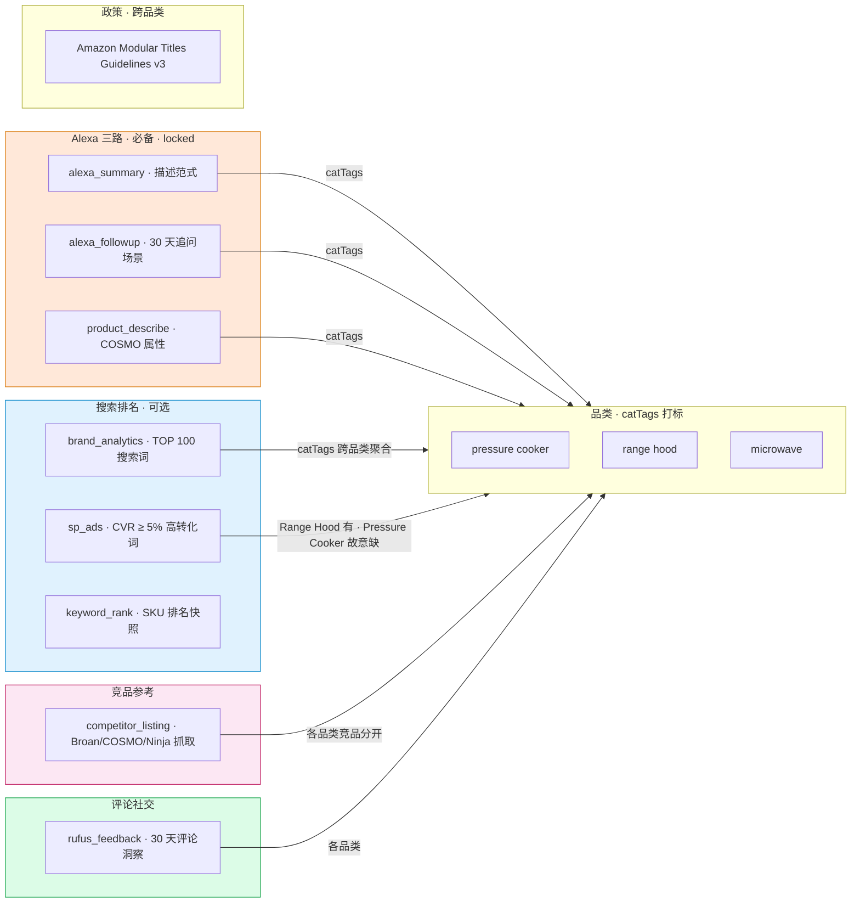
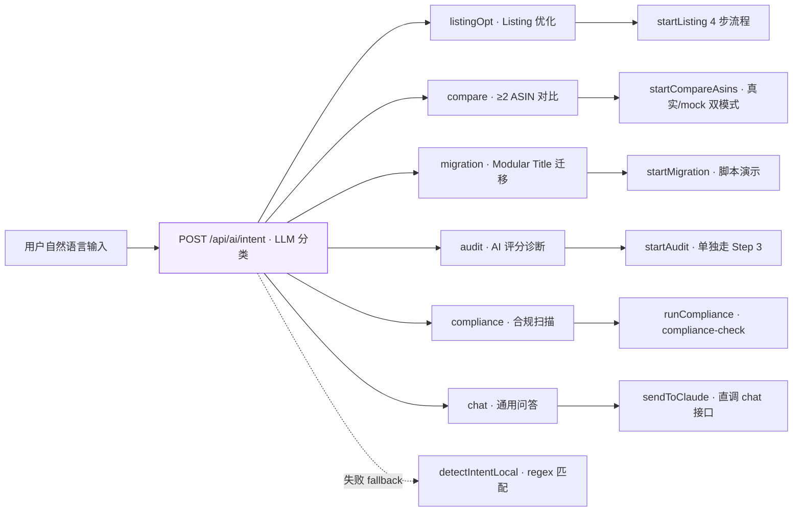
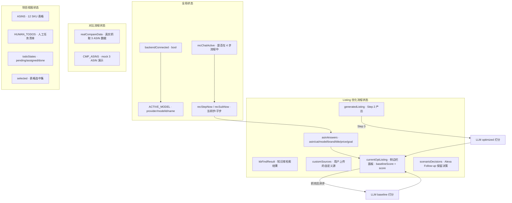
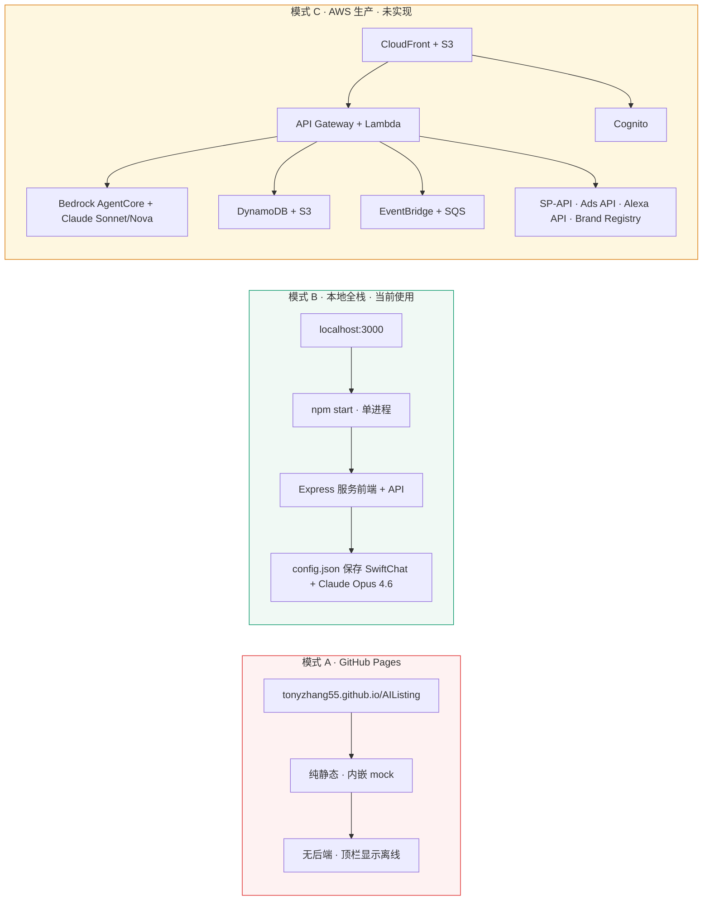

# AI Listing 优化引擎 · 知识图谱

面向 Amazon 卖家运营的 Listing 优化平台原型 · 3 层架构 · 4 类核心业务能力 · 8 类数据源。

## 1. 系统架构总览

## 2. REST API 端点图

## 3. Listing 优化 4 步流程 · 数据流

## 4. 数据源类型图谱

## 5. 意图路由 · 用户输入到功能的映射

## 6. 前端状态实体图

## 7. 部署形态

## 关键约定

- **业务数据唯一来源** · `backend/mock-data.js`（未来接入 SP-API 时替换）
- **配置数据唯一来源** · `backend/config.json`（gitignored · 通过 `providers.js` 存取）
- **LLM 分发唯一入口** · `askLLMForJSON`（自动剥离 markdown fence · 平衡括号提取）
- **意图路由降级** · LLM 失败 fallback 到 regex `detectIntentLocal`
- **前端 fallback** · 后端不可达时使用内嵌 mock（GitHub Pages 模式）
- **凭证脱敏** · 所有 config 返回都过 `maskKey` 处理
